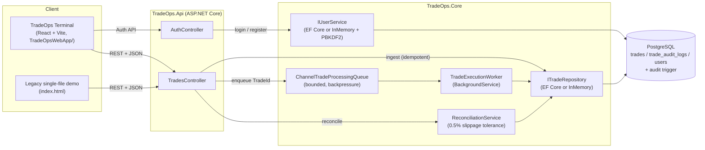

# TradeOps Sample Project

**By:** Joshua Kim C. Balanza  
**Stack:** .NET 9 (C#), EF Core, PostgreSQL, React (Vite), System.Threading.Channels, xUnit

A back-office trade ingestion, execution, and reconciliation platform for an FX/CFD desk — built to demonstrate **idempotent APIs, asynchronous processing, database-level auditability, and a full trading UI**, from login to reconciled trade.

---

## Table of Contents

1. [Project Overview & Architectural Highlights](#1-project-overview--architectural-highlights)
2. [Architecture Diagram](#2-architecture-diagram)
3. [Repository Layout](#3-repository-layout)
4. [Prerequisites](#4-prerequisites)
5. [Quickstart Instructions on macOS (VS Code)](#5-quickstart-instructions-on-macos-vs-code)
6. [API Reference](#6-api-reference)
7. [Domain Model & Trade Lifecycle](#7-domain-model--trade-lifecycle)
8. [Configuration & Environment Variables](#8-configuration--environment-variables)
9. [Testing](#9-testing)
10. [Design Notes & Trade-offs](#10-design-notes--trade-offs)

---

## 1. Project Overview & Architectural Highlights

In a trading environment, systems must guarantee **correctness, idempotency, strict auditability, and fault tolerance**.

This project provides an end-to-end solution:

1. **API Ingestion Layer (`TradeOps.Api`):**
   - Implements idempotent request handling via client-generated `IdempotencyKey`. Repeated network retries return the existing trade with `200 OK` without creating duplicate orders.
   - Dependency injection wires `ITradeRepository` to EF Core (Postgres) when a connection string is configured, or an in-memory repository otherwise.
2. **Data Access Layer (`TradeOps.Core/Data`):**
   - `TradeOpsDbContext` (EF Core + Npgsql provider) maps to the existing `trades` / `trade_audit_logs` tables, including native Postgres enum types (`order_side`, `trade_status`).
3. **High-Throughput In-Memory Pipeline (`TradeOps.Core`):**
   - Utilizes `System.Threading.Channels` with bounded capacity and backpressure (`BoundedChannelFullMode.Wait`).
   - `TradeExecutionWorker` consumes trades asynchronously without blocking API request threads.
4. **Reconciliation Engine:**
   - Compares internal executions against external broker execution reports.
   - Evaluates Symbol, Side, Quantity, and checks Price Drift against a **0.5% slippage tolerance**.
   - Automatically transitions state: within tolerance -> `Reconciled`; outside tolerance -> `Discrepancy` with detailed reason.
5. **PostgreSQL Production Schema (`sql/schema.sql`):**
   - Unique index on `idempotency_key`.
   - PL/pgSQL database trigger (`fn_audit_trade_status_change`) writing state transitions into an append-only `trade_audit_logs` table with `JSONB` payloads.
   - Composite indexing for fast back-office query filtering.
   - User authentication schema (`users` table) with case-insensitive unique username index.
6. **Authentication & User Directory (`TradeOps.Core/Services/IUserService` & `AuthController`):**
   - Secure PBKDF2 (SHA-256 with 100,000 iterations & random 16-byte salt) password hashing via standard .NET cryptography.
   - Real database registration (`POST /api/auth/register`) and login (`POST /api/auth/login`) persisted in PostgreSQL or in-memory fallback.
7. **TradeOps Terminal (`TradeOpsWebApp/`):**
   - Full React (Vite) single-page app simulating a trading desk: sign in / register account tabs, live dashboard, trade blotter with filters, an order ticket, and a trade detail view with audit trail + manual broker reconciliation.

---

## 2. Architecture Diagram



**Trade lifecycle:** `Pending` → (`TradeExecutionWorker`) → `Executed` → (broker report via `/reconcile`) → `Reconciled` or `Discrepancy`.

---

## 3. Repository Layout

```
capstone/
├── TradeOps.Api/            # ASP.NET Core Web API (Program.cs, TradesController, AuthController, DI wiring)
├── TradeOps.Core/           # Domain models, services, EF Core data layer
│   ├── Models/              # Trade, IngestTradeRequest, AuditLog, BrokerExecutionReport, UserModels (records)
│   ├── Services/             # ITradeRepository, IUserService, PasswordHasher, queue, worker, reconciliation
│   └── Data/                 # TradeOpsDbContext, TradeEntity, TradeAuditLogEntity, UserEntity
├── TradeOps.Tests/          # xUnit tests (TradeEngineTests, UserAuthTests)
├── sql/
│   ├── schema.sql            # Postgres schema (trades, trade_audit_logs, users, enums, indexes, audit trigger)
│   └── run_demo.py           # Standalone SQLite simulation of the schema/trigger logic
├── TradeOpsWebApp/           # React (Vite) TradeOps Terminal — full trading UI
│   └── src/
│       ├── api/               # tradesApi.js, authApi.js — fetch clients for TradeOps.Api
│       ├── auth/               # AuthContext.jsx (session state, auth API integration with offline fallback)
│       ├── components/        # Layout, ProtectedRoute, StatusBadge, MarketTicker
│       └── pages/              # Login/Register, Dashboard, Blotter, New Order, Trade Detail
├── docker-compose.yml        # PostgreSQL container, auto-applies sql/schema.sql on first boot
├── index.html                 # Legacy single-file React (CDN) demo of the same API
└── TradeOps.sln
```

---

## 4. Prerequisites

| Tool           | Version    | Notes                                                                 |
| -------------- | ---------- | --------------------------------------------------------------------- |
| .NET SDK       | 9.0+       | `dotnet --version`                                                    |
| Docker Desktop | any recent | for the PostgreSQL container                                          |
| Node.js        | 18+        | for `TradeOpsWebApp/` front-end (via `nvm`, `fnm`, or system install) |
| npm            | 9+         | ships with Node                                                       |

---

## 5. Quickstart Instructions on macOS (VS Code)

### Running Automated Unit Tests

Open VS Code terminal (`Cmd + ` `) and run:

```bash
dotnet test
```

**Test Coverage (`TradeOps.Tests`):**

- **Trade Engine (`TradeEngineTests.cs`)**:
  - Idempotency replay verification (prevents duplicate trades).
  - Slippage discrepancy detection (> 0.5% drift).
  - Healthy trade reconciliation matching broker reports.
- **Authentication (`UserAuthTests.cs`)**:
  - User registration with PBKDF2 password hashing.
  - Duplicate username rejection (`InvalidOperationException`).
  - Valid credential authentication returning user profiles.
  - Incorrect password rejection (`UnauthorizedAccessException`).

### Running the API

```bash
docker compose up -d postgres   # starts PostgreSQL with sql/schema.sql applied
dotnet run --project TradeOps.Api/TradeOps.Api.csproj
```

By default the API listens on `http://localhost:5025` (see `TradeOps.Api/Properties/launchSettings.json`). Without a running Postgres/connection string, the API automatically falls back to an in-memory repository — useful for quick demos or CI.

### Running the TradeOps Terminal (React front-end)

The full trading UI lives in `TradeOpsWebApp/` (Vite + React + React Router).

```bash
cd TradeOpsWebApp
npm install
npm run dev
```

Open the printed local URL (typically `http://localhost:5173`). Sign in with one of the demo accounts shown on the login screen (e.g. `trader1` / `demo123`).

The app calls the API at the URL configured in `TradeOpsWebApp/.env` (`VITE_API_BASE_URL`, defaults to `http://localhost:5025/api`) — copy `TradeOpsWebApp/.env.example` if you need to override it. CORS is already open (`AllowAnyOrigin`) on the API for local development.

**Flow covered end-to-end:** Login → Dashboard (live stats & market ticker) → New Order ticket (idempotent submission) → automatic background execution → Trade Detail (audit trail) → manual broker reconciliation.

The legacy single-file prototype (`index.html`, CDN React + Babel) is still available for a quick, dependency-free demo of the same API.

---

## 6. API Reference

### Trades API (`http://localhost:5025/api/trades`)

| Method | Route              | Description                                                                                        | Body                    |
| ------ | ------------------ | -------------------------------------------------------------------------------------------------- | ----------------------- |
| `POST` | `/`                | Ingest a new trade (idempotent on `idempotencyKey`). Returns `201` on new trades, `200` on replay. | `IngestTradeRequest`    |
| `GET`  | `/`                | List the 100 most recent trades.                                                                   | —                       |
| `GET`  | `/{id}`            | Get a single trade by `tradeId`.                                                                   | —                       |
| `GET`  | `/{id}/audit-logs` | Get the append-only audit trail for a trade.                                                       | —                       |
| `POST` | `/{id}/reconcile`  | Submit a broker execution report; transitions the trade to `Reconciled` or `Discrepancy`.          | `BrokerExecutionReport` |

### Authentication API (`http://localhost:5025/api/auth`)

| Method | Route        | Description                                                    | Body              |
| ------ | ------------ | -------------------------------------------------------------- | ----------------- |
| `POST` | `/register`  | Register a new user account in PostgreSQL.                     | `RegisterRequest` |
| `POST` | `/login`     | Verify credentials against PBKDF2 password hash in PostgreSQL. | `LoginRequest`    |
| `GET`  | `/me/{user}` | Get user profile by username.                                  | —                 |

`RegisterRequest`: `{ username, password, displayName, role, accountId }`  
`LoginRequest`: `{ username, password }`  
`IngestTradeRequest`: `{ idempotencyKey, accountId, symbol, side (0=Buy,1=Sell), quantity, price }`  
`BrokerExecutionReport`: `{ externalTradeId, symbol, side, quantity, executedPrice, executionTimeUtc }`

---

## 7. Domain Model & Trade Lifecycle

`TradeStatus`: `Pending (0)` → `Executed (1)` → `Reconciled (2)` | `Discrepancy (3)` | `Failed (4)`

1. **Ingest** — `POST /api/trades` validates the request, checks `idempotency_key` for a replay, and inserts a new `Pending` trade.
2. **Enqueue** — the new trade ID is pushed onto a bounded `System.Threading.Channels` queue.
3. **Execute** — `TradeExecutionWorker` (background service) dequeues, simulates broker routing latency, and transitions the trade to `Executed`.
4. **Reconcile** — `POST /api/trades/{id}/reconcile` compares the broker's execution report against the trade (symbol, side, quantity, and price within a 0.5% slippage tolerance) and marks it `Reconciled` or `Discrepancy` with a reason.
5. **Audit** — every status transition is recorded by a PostgreSQL trigger into `trade_audit_logs`, independent of the application layer.

---

## 8. Configuration & Environment Variables

| Location                                         | Key                          | Purpose                                                                                   |
| ------------------------------------------------ | ---------------------------- | ----------------------------------------------------------------------------------------- |
| `TradeOps.Api/appsettings.json`                  | `ConnectionStrings:Postgres` | Postgres connection string. If empty/missing, the API uses `InMemoryTradeRepository`.     |
| `TradeOpsWebApp/.env` (copy from `.env.example`) | `VITE_API_BASE_URL`          | Base URL the React app uses to call `TradeOps.Api` (default `http://localhost:5025/api`). |

---

## 9. Testing

`TradeOps.Tests` (xUnit) covers core business and security rules against in-memory providers (`InMemoryTradeRepository` and `InMemoryUserService`):

```bash
dotnet test
```

- **`TradeEngineTests.cs`**:
  - Idempotency replay verification (prevents duplicate trades).
  - Slippage discrepancy detection (> 0.5% drift).
  - Healthy trade reconciliation matching broker reports.
- **`UserAuthTests.cs`**:
  - Registration with PBKDF2 password hashing.
  - Duplicate username rejection.
  - Valid credential login.
  - Invalid password rejection.

`sql/run_demo.py` is a standalone SQLite script that simulates the same schema/trigger behavior outside of .NET, useful for verifying the audit-trigger logic in isolation.

---

## 10. Design Notes & Trade-offs

- **Idempotency** is enforced both in the API layer (check-then-insert) and at the database layer (`UNIQUE INDEX` on `idempotency_key`); a concurrent race is resolved by catching the Postgres unique-violation and returning the winning row.
- **EF Core + native Postgres enums**: `order_side`/`trade_status` are mapped via `NpgsqlDataSourceBuilder.MapEnum` _and_ `npgsqlOptions.MapEnum` (both are required — see inline comments in `Program.cs`) so C# enums round-trip as native Postgres enum types instead of integers.
- **`ITradeRepository` lifetime** differs by backend: `Scoped` when backed by EF Core's `DbContext` (Postgres), `Singleton` for the in-memory fallback. `TradeExecutionWorker` (a singleton `BackgroundService`) resolves the repository via `IServiceScopeFactory` per queue item to stay compatible with either lifetime.
- **Auditability lives in the database**, not just the app: the `fn_audit_trade_status_change` trigger guarantees every status change is logged even if it originates from a direct SQL update.
- **Authentication & User Management**: Passwords are securely hashed with PBKDF2 (SHA-256 with 100,000 iterations and a random 16-byte salt via standard .NET cryptography). User profiles are stored in the PostgreSQL `users` table via `PostgresUserService` and `AuthController` (`/api/auth/register`, `/api/auth/login`), with an in-memory fallback when running without a database connection.
